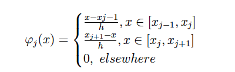
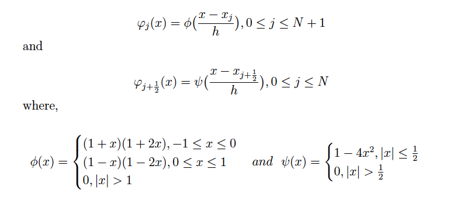
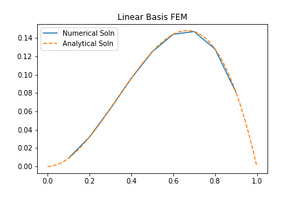
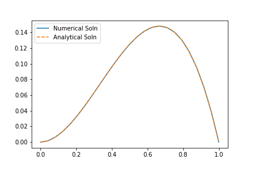

# 1DHigherOrderFEM

I implemented 1D Finite Element Method for two cases - Linear and Quadratic Basis functions.

## Theory 
Detailed theory for 1D FEMs for Linear and Quadratic Basis functions is present in ```report.pdf```

### Linear Basis
The basis functions used for the 1D Linear FEM is 




### Quadratic Basis
The basis functions used for the 1D Linear FEM is 




## Installations
Install the dependencies using -
```
pip install -r requirements.txt
```

## Running the code
Both of FEMs are present in ```1DFEM-Linear+Quad.py``` which can be run using - 
```
python 1DFEM-Linear+Quad.py
```
## Results



